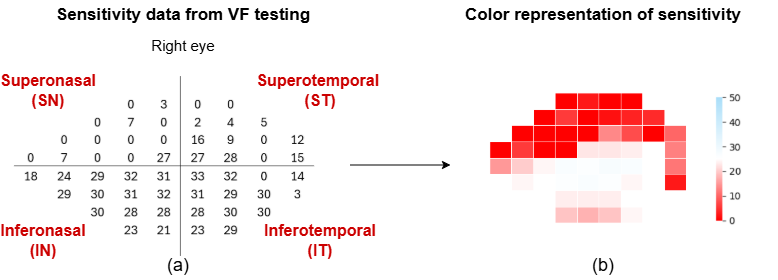
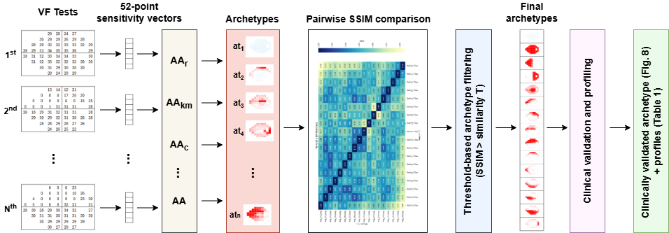

# 📄 Generalized Visual Field Pattern Discovery Using Archetypal Analysis
Official repository for the paper that will be presented in 12th OMIA workshop (2025).

Authors: Viska Mutiawani, Naeha Sharif, Nigel Morlet, Siobhan Manners, Ghulam Mubashar Hassan 
> Published in *Conference/Journal Name*, Year.  (Will be update once published)
> [Link to paper](https://doi.org/xxx) 

---

## 🗂️ Repository Structure

```plaintext
├── code/                # Source code for experiments
├── dataset/             # Dataset or links/instructions to access data
├── images/              # Figures and visualization results
├── results/             # Output files, metrics, logs
├── notebooks/           # Jupyter notebooks for demos or analysis
├── LICENSE
├── requirements.txt
└── README.md
````

---

## 🚀 Getting Started

### 1. Clone the repository

```bash
git clone https://github.com/your-username/your-repo-name.git
cd your-repo-name
```

### 2. Set up the environment

We recommend using a virtual environment:

```bash
python -m vfenv vfenv
source vfenv/bin/activate      # On Windows: vfenv\Scripts\activate
pip install -r requirements.txt
```

### 3. Run a sample experiment

Open and run the demo notebook:

```bash
jupyter notebook notebooks/demo.ipynb
```

---

## 📊 Results and Visualizations

You can find generated figures and outputs in the `images/` and `results/` folders.

### Visualization of Visual Field sensitivity value



---

## 📁 Dataset

* **Dataset Name**: UWHVF
* **Source**: [\[Download Link or DOI]](https://github.com/uw-biomedical-ml/uwhvf)
* **License**: BSD-3

Place the dataset in the following structure:

```plaintext
dataset/
└── dataset_name/

```

---

## 📦 Framework

### Methodology to find generalized VF patterns



---

## 📜 Citation

If you use this code or our paper, please cite: (will be updated once published)

```bibtex
@inproceedings{mutiawani2025generalized,
  title={Generalized Visual Field Pattern Discovery Using Archetypal Analysis},
  author={Mutiawani, Viska and Sharif, Naeha and Morlet, Nigel and Manners, Siobhan and Hassan, Ghulam Mubashar},
  booktitle={International Workshop on Ophthalmic Medical Image Analysis},
  pages={54--64},
  year={2025},
  organization={Springer}
}
```

## ⭐ Acknowledgements
We use the Archetypal Analysis code provided in [this site](https://researchdata.edu.au/archetypal-analysis-package/1424520) which is the same as archetypes library in Python.
The initialization method was adapted from [Mair](https://github.com/smair/archetypalanalysis-initialization). 
While the AAcoreset code was adapted from [Mair](https://github.com/smair/archetypalanalysis-coreset)

---

## 🤝 Q & A
You can check the contact if there is any question.

---

## 📄 License

This project is licensed under the [MIT License](LICENSE).

---

## 📬 Contact

* 📧 Email: [uwa email](mailto:viska.mutiawani@research.uwa.edu.au)
* 🌐 Website: 
* 🧑 GitHub: 

---


